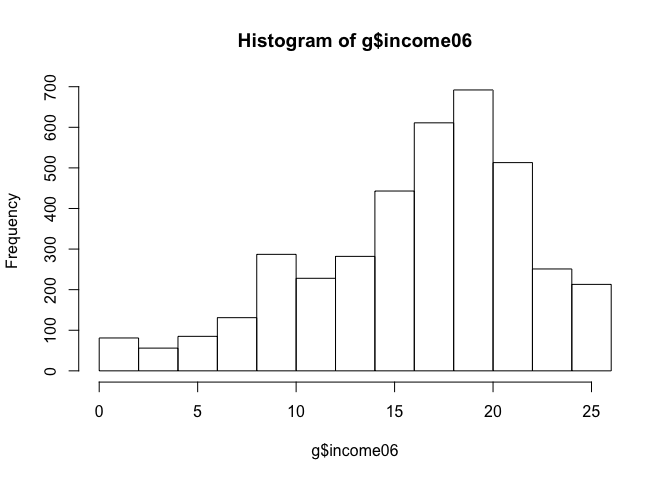

Immigration is a perpetual hot-button issue in American life and politics. In addition to debates over *who* should be allowed to immigrate to the U.S. (doctors? software engineers? refugees? family members of already settled immigrants?), there is disagreement over how many immigrants should be allowed in. This question is a charged and partisan one that came to the fore in the 2016 election, when then-candidate Donald Trump rallied many and offended others with his pledge to "build a wall" along our border with Mexico to stem the northbound tide of immigrants and to deport those without legal status.

The divisiveness of Trump's statements sparked my interest in the underlying factors that might explain individuals' views on immigration. Surely, it is a highly partisan issue -- Republican leaders and voters' stances tend to be unsympathetic to immigrants, whereas Democrats espouse their support of immigrants, often invoking the country's history as a "nation of immigrants" (though rarely does one hear a commitment to increase their numbers). However, I suspect that there is more to the story than this. The debate is often framed by liberals as revolving around empathy with the immigrant experience, the assumption being that if one were closer to the hardships people face in other countries and the challenges of building a life in the U.S., (s)he would be more compassionate toward immigrants and support policies that benefitted them.

One way that this empathy could be measured is in individuals' proximity to the immigrant experience in their own family tree: how many of someone's grandparents were foreign born. On the one hand, there is good reason to believe that having more grandparents who immigrated to the U.S. would make someone more aware of the difficulties faced by immigrants, and furthermore, they might see their own life and good fortune as an example of how U.S. immigration policy can create opportunities and even save lives. On the other hand, sometimes we see rhetoric amongst immigrant groups themselves that espouses "shutting the door" behind them. A prominent example is the Cuban-American community; some amongst this group have spoken of the need to crack down on illegal immigration, pointing to the great pain their families went through to complete the process legally. Families with closer proximity to immigration might also have more anxiety about the economic threat they perceive to be posed by immigrants. 

In all, there is reason to believe that views on immigration are result of complex processes, and that the attitudinal consequences of having immigrant grandparents is not obvious. This makes the topic ripe for statistical analysis in ths paper.

#1. Research Question

How do respondents' views on immigration differ according to how many of their grandparents were born in the United States? 

To examine this question, I use data from the 2006 General Social Survey. I chose to examine respondents' answers to "**LETIN1**" (Do you think the number of immigrants to America nowadays should be...," which has answer choices on a scale from "reduced a lot" to "increased a lot"); this is the dependent variable. The independent variable of interest here is the response to "**GRANBORN**" ("Were all of your four grandparents born in this country? (IF NO: How many were born outside the United States?)) (answer options range from 0 to 4).

#2. Hypothesis

Having more foreign-born grandparents is positively associated with supporting letting in more immigrants to the United States. Conversely, the more foreign-born grandparents one has, the less likely (s)he will be to want to decrease the number of immigrants permitted to enter.

#3. Data Summary and Exploratory Analysis

**_Recodes:_** My first step was to recode the dependent variable to improve interpretability. "GRANBORN" was coded in a logical manner and did not require manipulation.

In its original form, the response options for "LETIN1" (Do you think the number of immigrants to America nowadays should be ...) were numerical and corresponded with the answers as followed:

1) Increased a lot
2) Increased a little
3) Remain the same as it is	
4) Reduced a little
5) Reduced a lot
8) Can't choose
9) No answer

(Note: non-applicable responses, "can't choose" and "no answer," were automatically coded as NAs and excluded from analysis.)

"LETIN1"" is an ordinal, numeric variable with 5 relevant values. I reverse-coded the variable it so that higher values corresponded to more support for letting in more immigrants ("rletin") and created another variable for which I imputed the numbers' labels ("rletin.lab").


With the dependent variable in better shape for interpretation, I ran descriptive statistics, starting with a frequency table:

*Table 1: Frequency table for "rletin.lab"*

```
## 
##            reduced a lot         reduced a little remain the same as it is 
##                      558                      464                      677 
##       increased a little          increased a lot 
##                      170                       76
```

Most respondents wanted the number of immigrants to be increased either a lot or a little, and the most popular selection was that it remain the same. Few people (170) believe the number of immigrants should be increased "a little", and by far the fewest (76) believe that number should be increased "a lot".

*Table 2: Frequency table for "granborn"*

```
## 
##    0    1    2    3    4 
## 1676  181  275   72  649
```

The majority of respondents had all four of their grandparents born in the U.S. (1676 out of 2853, or 59%). The next most common answer was that people had all four grandparents born in the U.S. (640, or 23%). For the remainder, some but not all of their grandparents were born abroad.

*Table 3: Summary statistics for "rletin" and "granborn"*

```
## 
## ===============================================================
## Statistic   N   Mean  St. Dev. Min Pctl(25) Median Pctl(75) Max
## ---------------------------------------------------------------
## granborn  2,853 1.242  1.666    0     0       0       3      4 
## rletin    1,945 2.353  1.101    1     1       2       3      5 
## ---------------------------------------------------------------
```

The median response for "rletin" was 2: most people believe the number of immigrants should be "reduced a little". The mean was 2.353 and the interquartile range was 0-3 (so approximately 75% of respondents believe the number of immigrants should be reduced a lot or a little, or remain the same). For "granborn," the median response was 0: most people had no foreign-born grandparents. The mean was 1.242 and the interquartile range was 0-3 (approximately 75% of respondents had between 0 and 3 foreign-born grandparents). 


Both variables are right-skewed; that is, responses are clustered at the lower end. "Rletin" has a skewness value of 0.365 and "granborn" 0.828 -- both are evidence of strong right-skewedness. The distribution of responses for these variables are far from normal.

A cross-tabulation is useful for analyzing the relationship between "rletin" and "granborn":

*Table 4: Cross-tabulation of "rletin.lab" and "granborn"*

```
## 
##    Cell Contents
## |-------------------------|
## |                   Count |
## |          Column Percent |
## |-------------------------|
## 
## Total Observations in Table:  1855 
## 
##                          | g$granborn 
##             g$rletin.lab |        0  |        1  |        2  |        3  |        4  | Row Total | 
## -------------------------|-----------|-----------|-----------|-----------|-----------|-----------|
##            reduced a lot |      366  |       36  |       47  |       12  |       64  |      525  | 
##                          |   34.142% |   28.800% |   25.000% |   24.490% |   15.202% |           | 
## -------------------------|-----------|-----------|-----------|-----------|-----------|-----------|
##         reduced a little |      281  |       32  |       53  |       11  |       66  |      443  | 
##                          |   26.213% |   25.600% |   28.191% |   22.449% |   15.677% |           | 
## -------------------------|-----------|-----------|-----------|-----------|-----------|-----------|
## remain the same as it is |      336  |       45  |       67  |       15  |      185  |      648  | 
##                          |   31.343% |   36.000% |   35.638% |   30.612% |   43.943% |           | 
## -------------------------|-----------|-----------|-----------|-----------|-----------|-----------|
##       increased a little |       65  |        9  |       16  |        7  |       70  |      167  | 
##                          |    6.063% |    7.200% |    8.511% |   14.286% |   16.627% |           | 
## -------------------------|-----------|-----------|-----------|-----------|-----------|-----------|
##          increased a lot |       24  |        3  |        5  |        4  |       36  |       72  | 
##                          |    2.239% |    2.400% |    2.660% |    8.163% |    8.551% |           | 
## -------------------------|-----------|-----------|-----------|-----------|-----------|-----------|
##             Column Total |     1072  |      125  |      188  |       49  |      421  |     1855  | 
##                          |   57.790% |    6.739% |   10.135% |    2.642% |   22.695% |           | 
## -------------------------|-----------|-----------|-----------|-----------|-----------|-----------|
## 
## 
```


Looking at the cross-tabulated results of views on letting in immigrants and number of grandparents born abroad, it is not obvious that my hypothesis is borne out. There are indications that my hypothesis might hold water for the extreme views on immigration: amongst those with zero grandparents born abroad, 34% favored reducing immigration by a lot: amongst those with one grandparent born abroad, support for this change dropped to 29%, and to 25%, 25%, and 15% for those with 2, 3, and 4 grandparents born abroad, respectively. Conversely, we see the reverse pattern amongst those who favor increasing the number of immigrants by a lot: it appears to increase for each additional grandparent who was born abroad (2% if 0, 2% if 1, 3% if 2, 8% if 3, 9% if all 4). 

The pattern, however, is less clear amongst those with more moderate views on immigration. The only moderate category that shows the stepwise pattern described for the extreme positions was "increased a lot" -- the frequency of this view increased with each additional foregin grandparent one had. Of particular interest for further exploration, it was not at all clear that those with four foreign-born grandparents favored increasing levels of immigration. In fact, 44% of them preferred that immigration "remain the same as it is." Only 26% of this group favored increasing immigration levels at all.

The results of running these descriptive statistics convinced me that it does not make sense to treat the 1-5 scale for "rletin" as one ordinal varible that assumes equal distance between response options. Instead, I chose to divide the scale into three, and created a dummy variable for each. 1 and 2 represented wanting immigration levels to be reduced -- these were recoded as **rletin.less**. 3, the middle option, corresponded to wanting levels of immigration to remain the same -- this was recoded as **rletin.same**. Lastly, 4 and 5 represented wanting immigration levels to increase -- these were recoded as **rletin.more**.


#4) Initial models

With the outcomes recoded as dummy variables, my first instinct for analysis was to run three regressions to predict whether respondents supported 1) reducing the number of immigrants, 2) keeping the number the same, or 3) increasing it. Logistic regression is a useful tool in this context (predicting binary outcomes). It is superior to a linear probability model because for rletin.more, the probability of y = 1 is about 0.29, whereas LPM works best when Pr(y = 1) = 0.5. The results of the logistic regressions, along with the exponentiated coefficients, are below:

###Logistic regression 1: rletin.less


```
## 
## Call:
## glm(formula = rletin.less ~ granborn, family = binomial, data = g)
## 
## Deviance Residuals: 
##     Min       1Q   Median       3Q      Max  
## -0.9165  -0.9165  -0.7389   1.4630   1.9185  
## 
## Coefficients:
##             Estimate Std. Error z value Pr(>|z|)    
## (Intercept) -0.65021    0.06179 -10.523  < 2e-16 ***
## granborn    -0.25428    0.03511  -7.242 4.41e-13 ***
## ---
## Signif. codes:  0 '***' 0.001 '**' 0.01 '*' 0.05 '.' 0.1 ' ' 1
## 
## (Dispersion parameter for binomial family taken to be 1)
## 
##     Null deviance: 2210.4  on 1854  degrees of freedom
## Residual deviance: 2152.3  on 1853  degrees of freedom
##   (2655 observations deleted due to missingness)
## AIC: 2156.3
## 
## Number of Fisher Scoring iterations: 4
```

```
## (Intercept)    granborn 
##   0.5219366   0.7754737
```
For each additional grandparent foreign-born grandparent one has, their log-odds of believing the U.S. should let in fewer immigrants decrease by 25.4 (statistically significant). After exponentiating this coefficient, we see that the odds-ratio is 0.775. Because it it less than 1, we know that each additional foreign-born grandparent actually lowers the probability that someone would want a more restrictive immigration policy (by 1-0.775 = 0.225 or 22.5%). This comports with my hypothesis that having more grandparents who were born abroad might make that person more sympathetic to the immigrant experience. 

###Logistic regression 2: rletin.same


```
## 
## Call:
## glm(formula = rletin.same ~ granborn, family = binomial, data = g)
## 
## Deviance Residuals: 
##     Min       1Q   Median       3Q      Max  
## -1.0600  -0.9126  -0.8664   1.2995   1.5244  
## 
## Coefficients:
##             Estimate Std. Error z value Pr(>|z|)    
## (Intercept) -0.78652    0.06260 -12.564  < 2e-16 ***
## granborn     0.12598    0.02889   4.362 1.29e-05 ***
## ---
## Signif. codes:  0 '***' 0.001 '**' 0.01 '*' 0.05 '.' 0.1 ' ' 1
## 
## (Dispersion parameter for binomial family taken to be 1)
## 
##     Null deviance: 2400.5  on 1854  degrees of freedom
## Residual deviance: 2381.6  on 1853  degrees of freedom
##   (2655 observations deleted due to missingness)
## AIC: 2385.6
## 
## Number of Fisher Scoring iterations: 4
```

```
## (Intercept)    granborn 
##   0.4554285   1.1342624
```

For each additional grandparent foreign-born grandparent one has, their log-odds of believing the U.S. should let in the same number of immigrants increase by 12.6 (statistically significant). After exponentiating this coefficient, we see that the odds-ratio is 1.13. This means that each additional foreign-born grandparent increases by 13% the probability that someone would want U.S. policy to allow in the same number of immigrants as it does now. While my hypothesis did not deal directly with this middle response as its own outcome category, this result makes sense given my theories: having more foreign-born grandparents might mean that a person has greater confidence that the immigration system is functions best as it is -- after all, it worked out for them, presumably.

###Logistic regression 3: rletin.more


```
## 
## Call:
## glm(formula = rletin.more ~ granborn, family = binomial, data = g)
## 
## Deviance Residuals: 
##     Min       1Q   Median       3Q      Max  
## -0.9165  -0.9165  -0.7389   1.4630   1.9185  
## 
## Coefficients:
##             Estimate Std. Error z value Pr(>|z|)    
## (Intercept) -0.65021    0.06179 -10.523  < 2e-16 ***
## granborn    -0.25428    0.03511  -7.242 4.41e-13 ***
## ---
## Signif. codes:  0 '***' 0.001 '**' 0.01 '*' 0.05 '.' 0.1 ' ' 1
## 
## (Dispersion parameter for binomial family taken to be 1)
## 
##     Null deviance: 2210.4  on 1854  degrees of freedom
## Residual deviance: 2152.3  on 1853  degrees of freedom
##   (2655 observations deleted due to missingness)
## AIC: 2156.3
## 
## Number of Fisher Scoring iterations: 4
```

```
## (Intercept)    granborn 
##   0.5219366   0.7754737
```

For each additional grandparent foreign-born grandparent one has, their log-odds of believing the U.S. should let in more immigrants *decrease* by 25.4 (statistically significant). After exponentiating this coefficient, we see that the odds-ratio is 0.775, meaning that each additional foreign-born grandparent decreases by 22.5% the probability that someone would want U.S. policy to allow in more immigrants. This result shocked me; it contradicted my hypothesis. The fact that having more foreign-born grandparents actually decreases the likelihood that someone thinks more immigrants should be admitted to the U.S. might point to an alternative explanation: that the more proximity someone has to the immigrant experience, the more wary they might be of expanding the priviledges of U.S. residency to too many others. But before accepting such an explanation, it is worth analyzing more complex models with control variables, to see if it makes any difference in the results. 


#5) Complex model

My initial models were too reductive; they neglected to control for important covariates -- namely, income, sex, education, political views, and the region where the respondent lives. In addition to a person's family's proximity to the immigrant experience, I believe that these features might all be correlated with his/her views on immigration levels. Below, I outline how I expect these variables to relate to views on immigration, explain how I recoded them (if it was necessary to do so), and present some summary statistics.

***income:**

I believe that lower-earners might feel most threatened by immigrants, with whom they might compete for low-skilled labor (the media often explains xenophobia amongst low SES Americans in this way). Those with fewer economic resources might also be concerned about competing with immigrants for scarce government resources. So I would expect income to be positvely correlated with approval for letting in more immigrants. The variable for total family income (before taxes) in the prior year, "**income06**", had 25 response options that were binned ranges of income. Although resarchers often appl a log-transformation to income data, visualizing the variable did not reveal extreme skewness that might justify such a transformation (if anthing, the data was left-skewed), so I kept it as it was.

<!-- -->


***education:**

Similarly, those with more education might have jobs that are less threatened by globalization and immigrant labor, so I would expect education levels to be positvely associated with support for immigration. Education ("**Educ**") is coded in a logical manner in the GSS: it ranges from 0 to 20, with each value representing one's years of education. For some reason unknown to me, recoding "Educ" as "**Educa**" helped resolved an error in R, so I proceeded with this variable name.


***sex:**

Women are sometimes seen as more compassionate than men; because of this, I assume that they might be more sympathetic to letting in more immigrants; however, I don't expect this relationship to be particularly strong. I recoded "**sex**" as a dummy variable ("**female**" = 1, "male" = 0).


***political views:**

Views on immigration often fall along ideological lines, with conservative politicians and pundits favoring stemming the tide of immigration and deporting undocumented immigrants, while liberals espouse a more globalist stance that invokes America's history as a "nation of immigrants." Liberals tend to reaffirm Americans' obligation to reunite families and take in refugees from wars and crises around the world. The GSS measures political ideology ("**polviews**") on a scale from 1 (extremely liberal) to 7 (extremely conservative), with 4 representing moderates. Consequently, I would expect support for immigration to be negatively correlated with political views as measured on this scale (the more conservative one is, the less (s)he would favor increasing immigration / the more (s)he would favor decreasing the number of immigrants the U.S. permits to enter. For ease of interpretation, I reverse-coded the variable to make 1 represent extreme conservatives and 7 represent extreme liberals, and named it "**rpolviews**". (I now expect a positive correlation between this variable and support for immigration, or a negative correlation between this and opposition to immigration.)


***region:**

Lastly, I believe support for immigration might break down along regional lines. The debate over immigration is often focused on immigration from Central and South America through our border with Mexico (indeed, southern states like Texas have seen substantial increases in their immigrant populations in recent years). I assume that people who reside in southern states might believe that the U.S. already has too many immigrants and that if anything, rates of immigration should be decreased; I therefore predict that living in the South is negatively correlated with support for immigration. Note: while Southern states are not at all the only ones that have seen increasing numbers of immigrants in recent years, "the South" is commonly invoked as an ideological bloc, so they are included in this analysis as a dummy variable. For the GSS "**region**" of interview, I coded "**southern*" responses that were South Atlantic, East or West South Central = 1, everything else (non-Southern states) = 0.


Below is a summary table of descriptive statistics for "income06", female", "rpolviews", "southern", "educa":

*Table 5: Summary statistics for control variables*

```
## 
## ================================================================
## Statistic   N    Mean  St. Dev. Min Pctl(25) Median Pctl(75) Max
## ----------------------------------------------------------------
## income06  3,873 16.594  5.542    1     13      18      21    25 
## educa     4,499 13.293  3.229    0     12      13      16    20 
## female    4,510 0.556   0.497    0     0       1       1      1 
## rpolviews 4,333 3.883   1.414    1     3       4       5      7 
## southern  4,510 0.036   0.187    0     0       0       0      1 
## ----------------------------------------------------------------
```

The mean for income was 16.594 ($30,000 to $34,999), whereas the median was 18 ($40,000 to $49,999) because the income variable is somewhat left-skewed, as previously mentioned. 55.6% of the sample consisted of women. The mean ideological position in the sample was 3.883 (so slightly left of center), with a standard deviation of 1.414 points on the scale. Southerners represented a fairly small portion of the total sample -- only 3.6% of the total pool. The mean level of education was 13.293, which corresponds to just over a year of college. The standard deviation for "educa" was 3.229. 75% of respondents had between 12 and 16 years of education (so, three-quarters had an amount of education somewhere between graduating high school and graduating college). This is what I would have expected. 

Having taken a look at these control variables, I am ready to add them to the three logistic regression models from section 5:

###Logistic regression 1a: rletin.less


```
## 
## Call:
## glm(formula = rletin.less ~ granborn + female + rpolviews + southern + 
##     educa + income06, family = binomial, data = g)
## 
## Deviance Residuals: 
##     Min       1Q   Median       3Q      Max  
## -1.2826  -0.8553  -0.6522   1.2344   2.2283  
## 
## Coefficients:
##             Estimate Std. Error z value Pr(>|z|)    
## (Intercept)  1.06461    0.32889   3.237  0.00121 ** 
## granborn    -0.25098    0.04008  -6.263 3.79e-10 ***
## female       0.10408    0.11897   0.875  0.38167    
## rpolviews   -0.22035    0.04246  -5.190 2.10e-07 ***
## southern    -0.02668    0.33410  -0.080  0.93636    
## educa       -0.09078    0.02056  -4.415 1.01e-05 ***
## income06     0.01216    0.01170   1.040  0.29846    
## ---
## Signif. codes:  0 '***' 0.001 '**' 0.01 '*' 0.05 '.' 0.1 ' ' 1
## 
## (Dispersion parameter for binomial family taken to be 1)
## 
##     Null deviance: 1841.3  on 1578  degrees of freedom
## Residual deviance: 1744.4  on 1572  degrees of freedom
##   (2931 observations deleted due to missingness)
## AIC: 1758.4
## 
## Number of Fisher Scoring iterations: 4
```

```
## (Intercept)    granborn      female   rpolviews    southern       educa 
##   2.8997104   0.7780345   1.1096914   0.8022375   0.9736775   0.9132160 
##    income06 
##   1.0122362
```
For "rletin.less", including the control variables essentially did not change the log-odds of "granborn": it decreased by 25.1% in the expanded model, compared with 25.4% in the restricted model (still statistically significant); the odds-ratio is 0.778, compared with 0.775 in the previous model. So even controlling for sex, political views, living in the south, education, and income, each additional foreign-born grandparent one has actually lowers the probability that (s)he would want a more restrictive immigration policy by 1-0.778 = 0.222 or 22.2% -- only a .3% change from before. This constitutes strong evidence for my hypothesis. 

Of the control variables, only two were statistically significant: political views and education levels. Controlling for the other factors in this model, for each level more liberal one is in the GSS's ideological scale, they are 1 - 80.2 = 18.8% less likely to want a more restrictive immigration policy; this makes sense. Education was also negatively associated with supporting more restrictive immigration policies, as I predicted (controlling for these other factors, for each additional year of education, a person became 1-91.3 = 8.7% less likely to support such policies).

###Logistic regression 2a: rletin.same


```
## 
## Call:
## glm(formula = rletin.same ~ granborn + female + rpolviews + southern + 
##     educa + income06, family = binomial, data = g)
## 
## Deviance Residuals: 
##     Min       1Q   Median       3Q      Max  
## -1.3941  -0.9384  -0.8286   1.3439   1.9472  
## 
## Coefficients:
##             Estimate Std. Error z value Pr(>|z|)    
## (Intercept) -1.41039    0.29716  -4.746 2.07e-06 ***
## granborn     0.11884    0.03216   3.695  0.00022 ***
## female       0.02935    0.10823   0.271  0.78624    
## rpolviews    0.11180    0.03784   2.954  0.00313 ** 
## southern    -0.61776    0.31795  -1.943  0.05202 .  
## educa        0.03862    0.01858   2.079  0.03763 *  
## income06    -0.01893    0.01050  -1.802  0.07157 .  
## ---
## Signif. codes:  0 '***' 0.001 '**' 0.01 '*' 0.05 '.' 0.1 ' ' 1
## 
## (Dispersion parameter for binomial family taken to be 1)
## 
##     Null deviance: 2047.5  on 1578  degrees of freedom
## Residual deviance: 2013.2  on 1572  degrees of freedom
##   (2931 observations deleted due to missingness)
## AIC: 2027.2
## 
## Number of Fisher Scoring iterations: 4
```

```
## (Intercept)    granborn      female   rpolviews    southern       educa 
##   0.2440491   1.1261888   1.0297867   1.1182870   0.5391483   1.0393703 
##    income06 
##   0.9812507
```

Adding these control variables to the model for "rletin.same" also did not do much to alter the effect of "granborn": the log-odds was previously 12.6, and decreased a little in the expanded model to 11.9; the odds ratio remained the same at 1.13. Several of the control variables were slightly statistically significant, but none at the highest level: the odds-ratio of "rpolviews" was 1.118, so that for each level more liberal someone is, they become 11.8% more likely to want to keep immigration levels where they are now (controlling for other factors). For each additional year of education, one became 4% more likely to support such a policy. I remain perplexed that this counterintuitive result persisted even after controlling for sex, political views, southernness, education and income -- that having more foreign-born grandparents actually increases the likelihood that someone wants the level of immigration to remain the same as it is.

###Logistic regression 3a: rletin.more


```
## 
## Call:
## glm(formula = rletin.more ~ granborn + female + rpolviews + southern + 
##     educa + income06, family = binomial, data = g)
## 
## Deviance Residuals: 
##     Min       1Q   Median       3Q      Max  
## -1.2826  -0.8553  -0.6522   1.2344   2.2283  
## 
## Coefficients:
##             Estimate Std. Error z value Pr(>|z|)    
## (Intercept)  1.06461    0.32889   3.237  0.00121 ** 
## granborn    -0.25098    0.04008  -6.263 3.79e-10 ***
## female       0.10408    0.11897   0.875  0.38167    
## rpolviews   -0.22035    0.04246  -5.190 2.10e-07 ***
## southern    -0.02668    0.33410  -0.080  0.93636    
## educa       -0.09078    0.02056  -4.415 1.01e-05 ***
## income06     0.01216    0.01170   1.040  0.29846    
## ---
## Signif. codes:  0 '***' 0.001 '**' 0.01 '*' 0.05 '.' 0.1 ' ' 1
## 
## (Dispersion parameter for binomial family taken to be 1)
## 
##     Null deviance: 1841.3  on 1578  degrees of freedom
## Residual deviance: 1744.4  on 1572  degrees of freedom
##   (2931 observations deleted due to missingness)
## AIC: 1758.4
## 
## Number of Fisher Scoring iterations: 4
```

```
## (Intercept)    granborn      female   rpolviews    southern       educa 
##   2.8997104   0.7780345   1.1096914   0.8022375   0.9736775   0.9132160 
##    income06 
##   1.0122362
```

Controlling for the aforementioned variables, for each additional grandparent foreign-born grandparent one has, their log-odds of believing the U.S. should let in more immigrants decrease by 25.1 (statistically significant), which is nearly the same as the log-odds of 25.4 in the restricted model. The odds-ratio increased only slightly in this model, from 0.775 to 0.778, meaning that each additional foreign-born grandparent decreases by 22.2% the probability that someone would want U.S. policy to allow in more immigrants. As in the first model, "rpolviews" and "educa" are the only statistically significant coefficients. Controlling for the other factors, for each level more liberal one is, they become 1 - 80.2 = 18.8% less likely to want to expand immigration. For each additional year of education one has, they become 1 - 91.3 = 8.7% less likely to support expanding immigration. Both of these results contradicted my assumptions and surprised me. It is also curious that these odds-ratios were the same as for logistic model 1a (expanded model for "rletin.less"). If I had more time, I would like to dig into why this might be.

After seeing the results of the expanded logistic regressions and that not all of the variables seemed to be useful predictors of the outcome, I decided to restrict the expanded model to only include the independent variables that were statistically significant in all three models I ran three new logistic regressions (I called them "intermediate models") along the same lines as before, but included the following dependent variables: "granborn", "rpolviews", and "educa" (they are named logit1b, logit2b and logit 3b). Then, I created tables to compare the results:


*Table 6: Comparison of logit 1's (predicting "rletin.less")*

```
## 
## =================================================
##                         Dependent variable:      
##                   -------------------------------
##                             rletin.less          
##                      (1)        (2)       (3)    
## -------------------------------------------------
## granborn          -0.254***  -0.251*** -0.260*** 
##                    (0.035)    (0.040)   (0.037)  
##                                                  
## female                         0.104             
##                               (0.119)            
##                                                  
## rpolviews                    -0.220*** -0.239*** 
##                               (0.042)   (0.039)  
##                                                  
## southern                      -0.027             
##                               (0.334)            
##                                                  
## educa                        -0.091*** -0.090*** 
##                               (0.021)   (0.018)  
##                                                  
## income06                       0.012             
##                               (0.012)            
##                                                  
## Constant          -0.650***  1.065***   1.458*** 
##                    (0.062)    (0.329)   (0.279)  
##                                                  
## -------------------------------------------------
## Observations        1,855      1,579     1,805   
## Log Likelihood    -1,076.157 -872.210  -1,012.220
## Akaike Inf. Crit. 2,156.315  1,758.420 2,032.439 
## =================================================
## Note:                 *p<0.1; **p<0.05; ***p<0.01
```
*Table 7: Comparison of logit 2's (predicting "rletin.same")*

```
## 
## ==================================================
##                         Dependent variable:       
##                   --------------------------------
##                             rletin.same           
##                      (1)        (2)        (3)    
## --------------------------------------------------
## granborn           0.126***   0.119***   0.115*** 
##                    (0.029)    (0.032)    (0.030)  
##                                                   
## female                         0.029              
##                               (0.108)             
##                                                   
## rpolviews                     0.112***   0.113*** 
##                               (0.038)    (0.035)  
##                                                   
## southern                      -0.618*             
##                               (0.318)             
##                                                   
## educa                         0.039**    0.032**  
##                               (0.019)    (0.016)  
##                                                   
## income06                      -0.019*             
##                               (0.011)             
##                                                   
## Constant          -0.787***  -1.410***  -1.641*** 
##                    (0.063)    (0.297)    (0.255)  
##                                                   
## --------------------------------------------------
## Observations        1,855      1,579      1,805   
## Log Likelihood    -1,190.783 -1,006.576 -1,151.767
## Akaike Inf. Crit. 2,385.567  2,027.151  2,311.533 
## ==================================================
## Note:                  *p<0.1; **p<0.05; ***p<0.01
```
*Table 8: Comparison of logit 3's (predicting "rletin.more")*

```
## 
## =================================================
##                         Dependent variable:      
##                   -------------------------------
##                             rletin.more          
##                      (1)        (2)       (3)    
## -------------------------------------------------
## granborn          -0.254***  -0.251*** -0.260*** 
##                    (0.035)    (0.040)   (0.037)  
##                                                  
## female                         0.104             
##                               (0.119)            
##                                                  
## rpolviews                    -0.220*** -0.239*** 
##                               (0.042)   (0.039)  
##                                                  
## southern                      -0.027             
##                               (0.334)            
##                                                  
## educa                        -0.091*** -0.090*** 
##                               (0.021)   (0.018)  
##                                                  
## income06                       0.012             
##                               (0.012)            
##                                                  
## Constant          -0.650***  1.065***   1.458*** 
##                    (0.062)    (0.329)   (0.279)  
##                                                  
## -------------------------------------------------
## Observations        1,855      1,579     1,805   
## Log Likelihood    -1,076.157 -872.210  -1,012.220
## Akaike Inf. Crit. 2,156.315  1,758.420 2,032.439 
## =================================================
## Note:                 *p<0.1; **p<0.05; ***p<0.01
```
Log-odds for the intermediate models can be gleaned from the above tables. But for the purposes of model selection, I looked to the AIC to determine which model was the best fit, considering the tradeoffs of parsimony. I was surprised to find that for all three models, the expanded one (with all of the control variables) had the lowest AIC, indicating that it lost the least information. This is a perplexing result considering that the other explanatory variables were not statistically significant. If I had had more time, I would have liked to investigate this further and run more tests to help me decide on the best model. 

#6) Conclusion

My analyses revealed a mixed picture of the relationship between number of foreign-born grandparents and views on immigration. Indeed, the relationship appears to differ according to different levels of the outcome variable. Even when controlling for demographic features, it appears that the more foreign-born grandparents one has, the less likely they are to support restrictive immigration policies (makes sense), but counterintuitively, the more likely they are to want to keep immigration levels the same and the less likely they are to want to expand the access to immigration that their predecessors benefitted from. All in all, my hypothesis was only supported when looking at the likelihood of wanting to decrease the number of immigrants. Further research to strengthen this analysis might include adding other data (from the GSS or otherwise) to create a scale that might do a better job of accurately capturing immigration views. It would also be interesting to look at whether there is a non-linear relationship between "granborn" and the outcome variables; I would assume that having zero foreign-born grandparents might make people less sympathetic to immigrants, and that having all four of one's grandparents be born abroad might makek someone especially connected to the immigrant experience, but that having one, two or three foreign-born grandparents could go either way (or have no effect). 

From this project, I got a good sense of how many choices a researcher is confronted with, and how important it is to justify his/her choices at every level while not ruling out that there might be equally useful alternative approaches. I realized how critical it is to have clear, testable hypotheses at the outset to keep your research process focused. I also increased my comfort with R and R Markdown.
